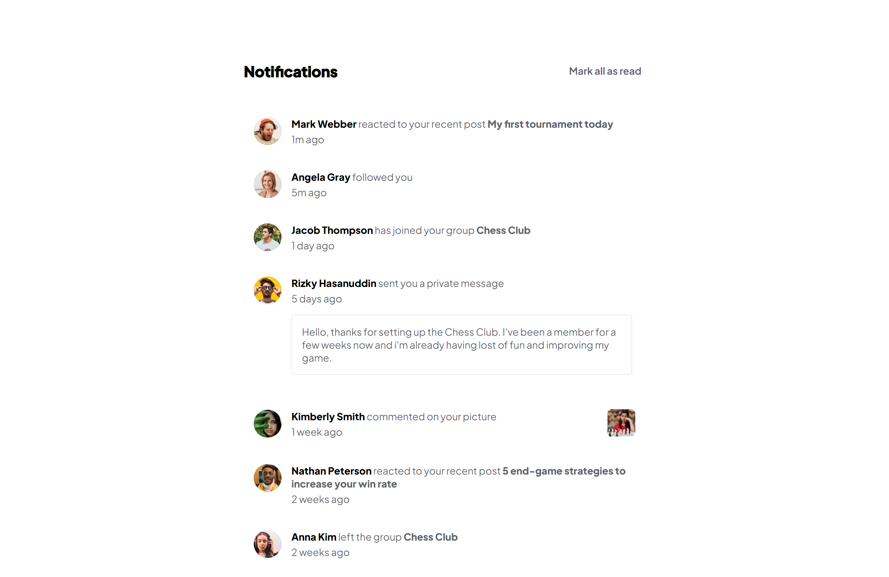

# Frontend Mentor - Notifications page solution

This is a solution to the [Notifications page challenge on Frontend Mentor](https://www.frontendmentor.io/challenges/notifications-page-DqK5QAmKbC). Frontend Mentor challenges help you improve your coding skills by building realistic projects. 

## Table of contents

- [Overview](#overview)
  - [The challenge](#the-challenge)
  - [Screenshot](#screenshot)
  - [Links](#links)
- [My process](#my-process)
  - [Built with](#built-with)
  - [What I learned](#what-i-learned)
  - [Useful resources](#useful-resources)
-[Local Deploy](#local-deploy)
- [Author](#author)


## Overview

### The challenge

Users should be able to:

- Distinguish between "unread" and "read" notifications
- Select "Mark all as read" to toggle the visual state of the unread notifications and set the number of unread messages to zero
- View the optimal layout for the interface depending on their device's screen size
- See hover and focus states for all interactive elements on the page

### Screenshot

.png)

.png)
.png)


### Links

- Solution URL: [notification-page-app github page](https://github.com/LucasNahuel/fem-notification-page.git)
- Live Site URL: [live notification-page-app deployment](https://fem-notification-page-navy.vercel.app/)

## My process

This was my first project using React.js after completing the tic-tac-toe game tutorial. This was a excelent oportunity to consolidate what i have learned from that. Dinamic components refresh was my mayor setback but thankfully i was able to solve it thanks to the State and Lifecycle page in the React docs.

### Built with

- Semantic HTML5 markup
- CSS custom properties
- Flexbox
- [React](https://reactjs.org/) - JS library

### What I learned

You can't import assests outside "public" or "src" folders in React.

I learnt to properly use the state property into the React components to refresh the elements and the flow of the state from parent to child trought the props, and the importance of the "setState" function, as well of the importance of use new objects in order to the changes being detected.


To mark notifications as "readed", i used:

```js
  let newNotifs = this.state.notifs; //where notifs is the data for the notifications
  let newNotificationsCount = 0;
  this.setState({notifs : newNotifs, newNotificationsCount});
```


### Useful resources
-[State and Lifecycle](https://reactjs.org/docs/state-and-lifecycle.html) - This was of big help

## Local Deploy

This is a react project, in order to deploy it locally, execute the next line into your console: 


```bash
  git clone https://github.com/LucasNahuel/fem-notification-page.git
```

once done, navigate to the root directory downloaded, then execute:

```bash
  npm install
```

and, finally, execute it with:

```bash
  npm start
```

if all went alright, you will be see the notification page in your brower in your localhost, port 3000.


## Author

- Website - [Lucas Muñoz](https://angular-portfolio-lake.vercel.app/)
- Frontend Mentor - [@LucasNahuel](https://www.frontendmentor.io/profile/LucasNahuel)
